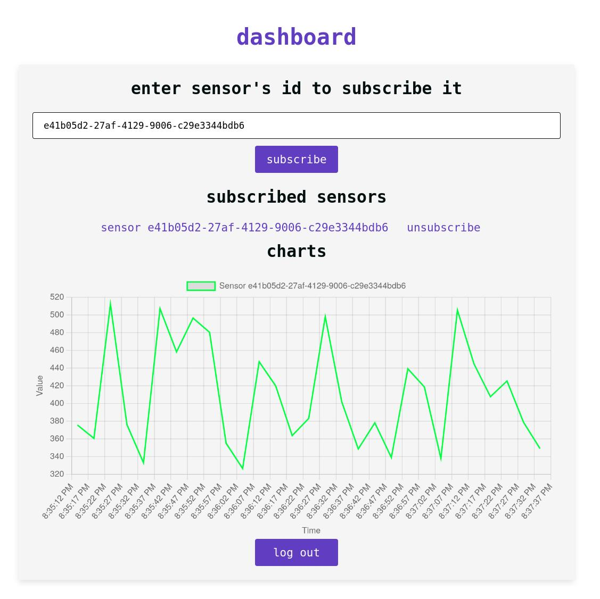

# Insight Naturae
**Insight Naturae** is a lightweight Go application that **collects and visualizes real-time data** from multiple sensors. It subscribes to user-defined topics on a chosen **MQTT** broker, storing incoming data in a **SQLite3** database. An API is provided for **account creation** and **subscription management**, while **secure WebSockets** stream sensor updates directly to subscribers. On the front-end, a straightforward JavaScript dashboard application lets users **register, log in, subscribe/unsubscribe from sensors**, and monitor historical data in dynamically updated charts. TLS-based encryption ensures secure communication, requiring the generation of necessary certificates.

## Prerequisites
Before you begin, ensure you have met the following requirements:
- **Go** (version **1.16** or highier)
- An **MQTT** broker of your choice (e.g., Mosquitto)

## Installation
1. Clone the repository
    ```
    git clone https://github.com/kajtekajtek/insight-naturae.git
    cd insight-naturae
    ```
2. Install dependencies:
    ```
    go mod download
    ```
3. (Optional) Set up the environment variables:
    ```
    cp .env.example .env
    ```
4. Generate certificates. You can use the utility script:
    ```
    ./scripts/generate_certs.sh
    ```
    Make sure that your browser trusts your certificate

## Configuration
Default configuration options are specified in the `.env.example` file. To customize settings, create and edit your own `.env` file as needed.

## Usage
A quick start simulation is available with `mosquitto` (see **Examples** below).
### Running the Backend Application
1. Run an mqtt broker of your choice.
2. Start the server:
    ```
    go run cmd/server/main.go
    ```
3. (Optional) Run the sensor simulation:
    ```
    go run cmd/sensorsim/main.go
    ```

### Running the Client Application
Host the simple client app in the frontend/ directory using any HTTP server. For example:
1. Using Python's HTTP server:
    ```
    cd frontend
    python3 -m http.server 5000
    ```
2. Using Node.js http-server:
    ```
    npm install -g http-server
    cd frontend
    http-server -p 5000
    ```

## Examples
Use the `./scripts/run_simulation_with_mosquitto.sh` script to quickly test the application with the `mosquitto` broker. This script launches the broker, the server, and the simulation. Afterward, you can run:
```
./scripts/dump_table.sh SensorData
```
to retrieve the simulated sensor IDs. Then, in the client dashboard, create an account and subscribe to your chosen sensors.



## Directory Structure
```
.
├── cmd                 # Main applications
│   ├── sensorsim      
│   └── server
├── docs                # Assets for documentation
├── frontend            # Client dashboard
│   ├── css
│   └── js
├── internal            # Private, project-specific code
│   ├── api
│   ├── config
│   ├── dbutils
│   ├── jwtutils
│   ├── middleware
│   ├── mqttutils
│   ├── sensors
│   └── wsutils
├── pkg                 # Reusable code
│   ├── database
│   ├── models
│   ├── mqtt
│   └── utils
└── scripts             # Utility scripts
```

## Testing
- To run tests, use:

    ```
    go test ./...
    ```

## License
This project is licensed under the **GPLv3** License. See the `LICENSE` file for more details.